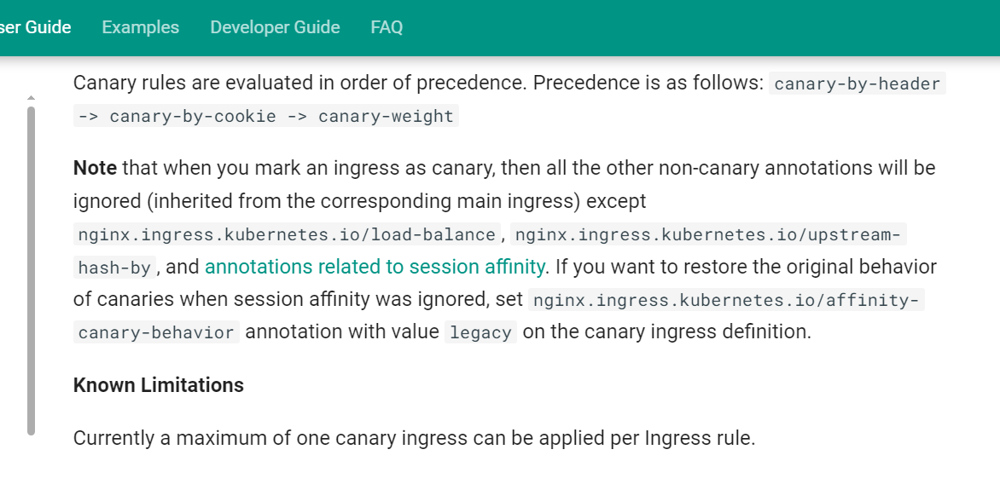

# infra-asssignment
Kubernetes manifests for running two different applications in a minikube cluster exposing them using an ingress controller and Terraform manifests to automate the provioning and management of the same infra setup.

# Steps to reproduce in local minikube based environment

1. Create a minikube cluster 
minikube start

2. Navigate to kube_manifests directory and apply all the manifests
cd kube_manifests

kubectl apply -f .

3. Check the status of the pods, you should see 2 blue-app and 3 green-app pods running respectively.  

kubectl get pods -A

4. Check the Address is populated for ingress or not

kubectl get ingress

5. Modify the hosts file on system adding an entry for the domain name

sudo vi /etc/hosts
<IP Address>  blue-green.com

6. Verify the blue-green weight-based ingress load balancing by following command:- 

for i in {1..20}; do curl blue-green.com; done;

7. In another terminal, run this command minikube tunnel. In cloud provider environment external LB will be provisioned but in local minikube environment, it's a handy utility. Otherwise, Terraform will keep on trying to create the helm chart as the provider is written in a way to check for External IP.

minikube tunnel

8. For infrastructure automation Stretch Goal, navigate to iac dirrectory and run the following commands and let terraform do it's magic

terraform init
terraform plan -out=tfplan
terraform apply tfplan

9. To access the service, first fetch the IP Address of the ingress

kubectl get ingress

10. Copy the Address, Open DNS entry file

sudo vi /etc/hosts

Add an entry:-
<IP Address>  www.example.io

11. Access the services by making curl requests

for i in {1..20}; do curl www.example.io; done;

12. After the verification of all the resources, remember to destroy them

terraform destroy

** The canary weighted-ingress doesn't work for more than 2 services. It is not supported by nginx from what I could explore. For more than two service, Service Mesh pattern can be used.

Reference:- 

1. https://kubernetes.github.io/ingress-nginx/user-guide/nginx-configuration/annotations/#canary

